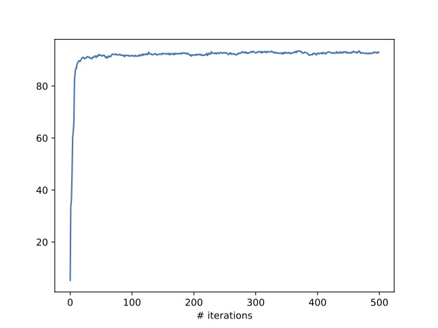

# CorEx S&P500

Correlation Explanation applied to S&P 500 data.

This is a replication of the CorEx finance data example in _Maximally informative hierarchical representations of high-dimensional data_ [Ver Steeg & Galstyan (2015)](#references).

## Background

Correlation Explanation (CorEx) is an unsupervised method for producing probabilistic hierarchical informative representations. The idea is the representations should be based on maximizing information, the multivariate mutual information or total correlation.

Total correlation, or multivariate mutual information, is a measure of dependence. If _X_ is a set of one or more variables, and _Y_ is another, then the decrease in total correlation between _X_ and _X_|_Y_ approximates how much _Y_ explains _X_. Total correlation is zero if and only if the set of variables are independent and is maximized when a single variable explains all others in the set. CorEx uses latent factors, _Y_, to minimize the correlation in the data, _X_, when conditioned on those factors (_X_ | _Y_).

CorEx constructs tree-like structures from the data. Unlike traditional agglomerative clustering, CorEx uses an information metric rather than distance metric.

For more information about CorEx, see [Ver Steeg & Galstyan (2014)](#references).

## Data

The dataset consists of daily stock quotes for S&P 500 companies from January 1988 through July 2013. The data is transformed from a long to wide format where each column represents a company and rows represents the return (as a percent) from the previous month. 

The data was obtained from [QuantQuote](https://quantquote.com), a provider of historical stock market data, and loaded into a Postgres database (see [ellisvalentiner/QuantQuoteHistoricalIngest](https://github.com/ellisvalentiner/QuantQuoteHistoricalIngest)). I calculate the monthly return using the first trading day of the month.

Although the S&P 500 index is made up of approximately 500 companies at a given time, companies enter and exit the index so only 388 companies have complete data for this time period. As in [Ver Steeg & Galstyan (2015)](#references), this analysis excluded companies without complete data for the study period. While CorEx can handle missingness, the authors noted that missing not at random (MNAR) hasn't been extensively investigated.

It's important to note that this may introduce a survivorship bias effect: companies that remained in the index during this time may be more correlated than those that left/entered the index. This is difficult to assess because companies may exit the index for several reasons (market cap changes, taken private, acquisitions, etc.) creating room for new companies to enter. Further changes to the index occur at defined times, so several companies may enter and exit simultaneously.

## Model

> We use a representation with _m1_ 20, _m2_ 3, _m3_ = 1, and _Yj_ were discrete trinary variables. [Ver Steeg & Galstyan (2015)](#references)

I fit a CorEx model consisting of three layers with 20, 3, and 1 units. The hidden factor at each layer takes 3 discrete values.

The authors specified the 100 iterations with multiple restarts. I set the maximum number of iterations to 500 for each layer with multiple restarts and use up to 1,000 samples per iteration.

## Result

### Convergence

Although the first two layers did not converge within 500 iterations, there was no substantial improvement after the early iterations. The third layer converged after 10 iterations.

**First layer convergence**

**Second layer convergence**

**Third layer convergence**

### Learned Representation

Figure 4 in [Ver Steeg & Galstyan (2015)](#references) shows the structure of the learned representation. The structure corresponding to Global Industry Classification Standard (GICS) sectors. The edge thickness is proportional to mutual information and node size reflective of multivariate mutual information among child nodes.

The authors presented graphs with thresholded weights at 0.16 for display and later noted this was about 400 edges. The appendix included a graph using a lower, unspecified threshold.

I generated graphs using 380, 390, and 400 edges.

**Graph with 380 nodes**

**Graph with 390 nodes**

**Graph with 400 nodes**

**Utilities Cluster**

## Conclusion

The results were fairly similar to Ver Steeg & Galstyan in that the learned representation appeared to recover GICS sector relationships. Notably the GICS sectors for materials and utilities were well clustered. Differences may be due to inadvertent misspecification of the model and sensitivity to parameters.

Additionally Ver Steeg & Galstyan thresholded weights to determine the maximum number of edges, however I specified the number of edges exactly. This is because the visualization tools included in the corex module prefer specifying the number of edges. Although it would not be difficult to rewrite portions of these functions, it also wasn't my focus. This would be a good opportunity to improve this project.

It is also worth noting that the GICS changes over time. On August 31, 2016 a new sector for real estate was added to the GICS. I have not fully investigated how this may affect the results.

While it is unsurprising that companies are clustered within GICS sectors, the interesting piece is being able to visualize and quantify how companies are correlated within and between sectors. Given clusters, it is possible to monitor how well a company is performing relative to a meaningful subset of the S&P 500. For example, a company that begins to diverge from its clusters may signal interesting trends or changes to the market.

## References

Ver Steeg, G., & Galstyan, A. (2014). Discovering structure in high-dimensional data through correlation explanation. In _Advances in Neural Information Processing Systems_ (pp. 577-585). ([arXiv](https://arxiv.org/abs/1406.1222))

Ver Steeg, G., & Galstyan, A. (2015). Maximally informative hierarchical representations of high-dimensional data. In _Artificial Intelligence and Statistics_ (pp. 1004-1012). ([arXiv](https://arxiv.org/abs/1410.7404v2))
